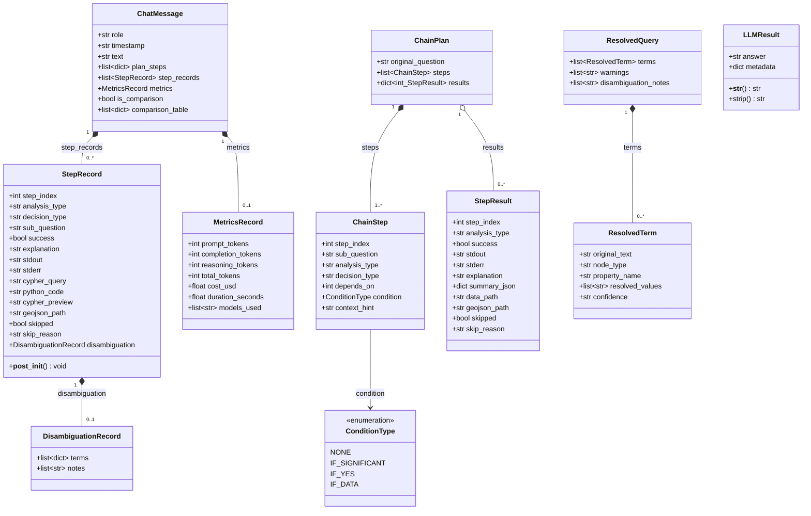

# UML-Klassendiagramm: Datenmodell

> **Quellen:** `app/chat_models.py`, `modules/chain.py`, `modules/disambiguator.py`, `modules/helper.py`

**Hinweise:**
- `StepRecord.__post_init__()` trunciert: MAX_STDOUT=5000, MAX_CODE=10000, MAX_PREVIEW=10000
- `ChatMessage`: MAX_TURNS=50 (= 100 Nachrichten)
