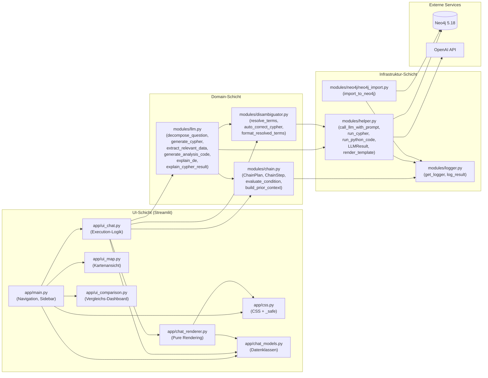

# Komponentendiagramm: Modulabhaengigkeiten in 4 Schichten

> **Quellen:** `app/main.py`, `app/ui_chat.py`, `modules/llm.py`, `modules/helper.py`

```mermaid
flowchart LR
    subgraph UI["UI-Schicht (Streamlit)"]
        MAIN["app/main.py\n(Navigation, Sidebar)"]
        CHAT["app/ui_chat.py\n(Execution-Logik)"]
        REND["app/chat_renderer.py\n(Pure Rendering)"]
        MAP["app/ui_map.py\n(Kartenansicht)"]
        COMP["app/ui_comparison.py\n(Vergleichs-Dashboard)"]
        CSS["app/css.py\n(CSS + _safe)"]
        MODELS["app/chat_models.py\n(Datenklassen)"]
    end

    subgraph Domain["Domain-Schicht"]
        LLM["modules/llm.py\n(decompose_question,\ngenerate_cypher,\nextract_relevant_data,\ngenerate_analysis_code,\nexplain_de,\nexplain_cypher_result)"]
        CHAIN["modules/chain.py\n(ChainPlan, ChainStep,\nevaluate_condition,\nbuild_prior_context)"]
        DISAMB["modules/disambiguator.py\n(resolve_terms,\nauto_correct_cypher,\nformat_resolved_terms)"]
    end

    subgraph Infra["Infrastruktur-Schicht"]
        HELPER["modules/helper.py\n(call_llm_with_prompt,\nrun_cypher, run_python_code,\nLLMResult, render_template)"]
        LOGGER["modules/logger.py\n(get_logger, log_result)"]
        IMPORT["modules/neo4j/neo4j_import.py\n(import_to_neo4j)"]
    end

    subgraph External["Externe Services"]
        NEO4J[("Neo4j 5.18")]
        OPENAI["OpenAI API"]
    end

    MAIN --> CHAT
    MAIN --> MAP
    MAIN --> COMP
    MAIN --> CSS
    MAIN --> MODELS
    CHAT --> REND
    CHAT --> MODELS
    REND --> MODELS
    REND --> CSS

    CHAT --> LLM
    CHAT --> CHAIN
    CHAT --> DISAMB

    LLM --> CHAIN
    LLM --> DISAMB

    LLM --> HELPER
    DISAMB --> HELPER
    CHAIN --> LOGGER

    HELPER --> OPENAI
    HELPER --> NEO4J
    HELPER --> LOGGER
    IMPORT --> NEO4J
    IMPORT --> LOGGER
```
