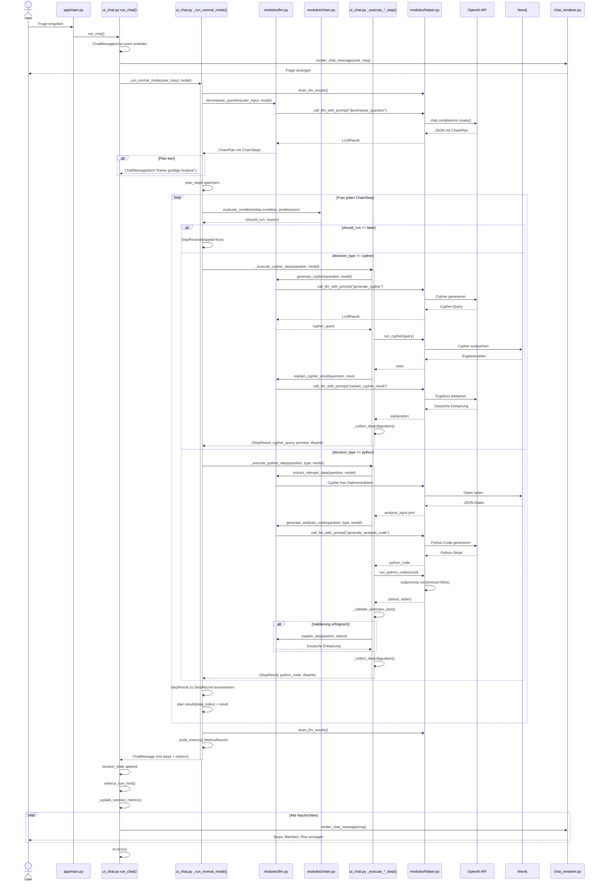

# Sequenzdiagramm: Normaler Chat-Flow

> **Quellen:** `app/ui_chat.py:519` (run_chat), `app/ui_chat.py:294` (_run_normal_mode)

```mermaid
sequenceDiagram
    actor User
    participant main as app/main.py
    participant chat as ui_chat.py run_chat()
    participant normal as ui_chat.py _run_normal_mode()
    participant llm as modules/llm.py
    participant chain as modules/chain.py
    participant exec as ui_chat.py _execute_*_step()
    participant helper as modules/helper.py
    participant openai as OpenAI API
    participant neo4j as Neo4j
    participant renderer as chat_renderer.py

    User->>main: Frage eingeben
    main->>chat: run_chat()
    chat->>chat: ChatMessage(role=user) erstellen
    chat->>renderer: render_chat_message(user_msg)
    renderer-->>User: Frage anzeigen

    chat->>normal: _run_normal_mode(user_input, model)
    activate normal
    normal->>helper: drain_llm_results()
    normal->>llm: decompose_question(user_input, model)
    llm->>helper: call_llm_with_prompt("decompose_question")
    helper->>openai: chat.completions.create()
    openai-->>helper: JSON mit ChainPlan
    helper-->>llm: LLMResult
    llm-->>normal: ChainPlan mit ChainSteps

    alt Plan leer
        normal-->>chat: ChatMessage(text="Keine gueltige Analyse")
    end

    normal->>normal: plan_steps speichern

    loop Fuer jeden ChainStep
        normal->>chain: evaluate_condition(step.condition, predecessor)
        chain-->>normal: (should_run, reason)

        alt should_run == false
            normal->>normal: StepRecord(skipped=true)
        else decision_type == cypher
            normal->>exec: _execute_cypher_step(question, model)
            activate exec
            exec->>llm: generate_cypher(question, model)
            llm->>helper: call_llm_with_prompt("generate_cypher")
            helper->>openai: Cypher generieren
            openai-->>helper: Cypher-Query
            helper-->>llm: LLMResult
            llm-->>exec: cypher_query

            exec->>helper: run_cypher(query)
            helper->>neo4j: Cypher ausfuehren
            neo4j-->>helper: Ergebniszeilen
            helper-->>exec: rows

            exec->>llm: explain_cypher_result(question, rows)
            llm->>helper: call_llm_with_prompt("explain_cypher_result")
            helper->>openai: Ergebnis erklaeren
            openai-->>helper: Deutsche Erklaerung
            helper-->>exec: explanation

            exec->>exec: _collect_disambiguation()
            exec-->>normal: (StepResult, cypher_query, preview, disamb)
            deactivate exec

        else decision_type == python
            normal->>exec: _execute_python_step(question, type, model)
            activate exec
            exec->>llm: extract_relevant_data(question, model)
            llm->>helper: Cypher fuer Datenextraktion
            helper->>neo4j: Daten laden
            neo4j-->>helper: JSON-Daten
            helper-->>exec: analysis_input.json

            exec->>llm: generate_analysis_code(question, type, model)
            llm->>helper: call_llm_with_prompt("generate_analysis_code")
            helper->>openai: Python-Code generieren
            openai-->>helper: Python-Skript
            helper-->>exec: python_code

            exec->>helper: run_python_code(script)
            helper->>helper: subprocess.run(timeout=900s)
            helper-->>exec: (stdout, stderr)

            exec->>exec: _validate_summary_json()

            alt Validierung erfolgreich
                exec->>llm: explain_de(question, stdout)
                llm-->>exec: Deutsche Erklaerung
            end

            exec->>exec: _collect_disambiguation()
            exec-->>normal: (StepResult, python_code, disamb)
            deactivate exec
        end

        normal->>normal: StepResult zu StepRecord konvertieren
        normal->>normal: plan.results[step_index] = result
    end

    normal->>helper: drain_llm_results()
    normal->>normal: _build_metrics() MetricsRecord
    normal-->>chat: ChatMessage (mit steps + metrics)
    deactivate normal

    chat->>chat: session_state append
    chat->>chat: enforce_turn_limit()
    chat->>chat: _update_session_metrics()

    loop Alle Nachrichten
        chat->>renderer: render_chat_message(msg)
        renderer-->>User: Steps, Metriken, Plan anzeigen
    end

    chat->>chat: st.rerun()
```
