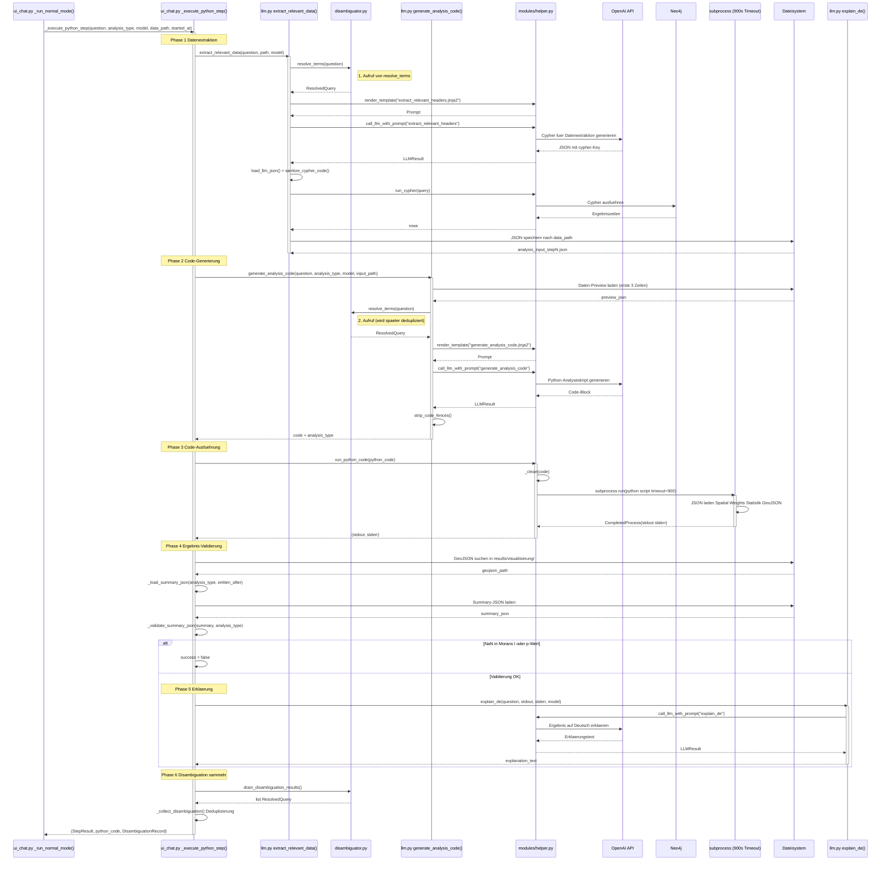

# Sequenzdiagramm: Detaillierter Python-Analyse-Schritt

> **Quellen:** `app/ui_chat.py:195` (_execute_python_step), `modules/llm.py`

```mermaid
sequenceDiagram
    participant chat as ui_chat.py _run_normal_mode()
    participant exec as ui_chat.py _execute_python_step()
    participant extract as llm.py extract_relevant_data()
    participant disamb as disambiguator.py
    participant gen as llm.py generate_analysis_code()
    participant helper as modules/helper.py
    participant openai as OpenAI API
    participant neo4j as Neo4j
    participant sub as subprocess (900s Timeout)
    participant fs as Dateisystem
    participant explain as llm.py explain_de()

    chat->>exec: _execute_python_step(question, analysis_type, model, data_path, started_at)
    activate exec

    Note over exec: Phase 1 Datenextraktion

    exec->>extract: extract_relevant_data(question, path, model)
    activate extract
    extract->>disamb: resolve_terms(question)
    Note right of disamb: 1. Aufruf von resolve_terms
    disamb-->>extract: ResolvedQuery
    extract->>helper: render_template("extract_relevant_headers.jinja2")
    helper-->>extract: Prompt
    extract->>helper: call_llm_with_prompt("extract_relevant_headers")
    helper->>openai: Cypher fuer Datenextraktion generieren
    openai-->>helper: JSON mit cypher-Key
    helper-->>extract: LLMResult
    extract->>extract: load_llm_json() + sanitize_cypher_code()
    extract->>helper: run_cypher(query)
    helper->>neo4j: Cypher ausfuehren
    neo4j-->>helper: Ergebniszeilen
    helper-->>extract: rows
    extract->>fs: JSON speichern nach data_path
    fs-->>extract: analysis_input_stepN.json
    deactivate extract

    Note over exec: Phase 2 Code-Generierung

    exec->>gen: generate_analysis_code(question, analysis_type, model, input_path)
    activate gen
    gen->>fs: Daten-Preview laden (erste 3 Zeilen)
    fs-->>gen: preview_json
    gen->>disamb: resolve_terms(question)
    Note right of disamb: 2. Aufruf (wird spaeter dedupliziert)
    disamb-->>gen: ResolvedQuery
    gen->>helper: render_template("generate_analysis_code.jinja2")
    helper-->>gen: Prompt
    gen->>helper: call_llm_with_prompt("generate_analysis_code")
    helper->>openai: Python-Analyseskript generieren
    openai-->>helper: Code-Block
    helper-->>gen: LLMResult
    gen->>gen: strip_code_fences()
    gen-->>exec: code + analysis_type
    deactivate gen

    Note over exec: Phase 3 Code-Ausfuehrung

    exec->>helper: run_python_code(python_code)
    activate helper
    helper->>helper: _clean(code)
    helper->>sub: subprocess.run(python script timeout=900)
    activate sub
    sub->>sub: JSON laden Spatial Weights Statistik GeoJSON
    sub-->>helper: CompletedProcess(stdout stderr)
    deactivate sub
    helper-->>exec: (stdout, stderr)
    deactivate helper

    Note over exec: Phase 4 Ergebnis-Validierung

    exec->>fs: GeoJSON suchen in results/visualisierung/
    fs-->>exec: geojson_path
    exec->>exec: _load_summary_json(analysis_type, written_after)
    exec->>fs: Summary-JSON laden
    fs-->>exec: summary_json

    exec->>exec: _validate_summary_json(summary, analysis_type)

    alt NaN in Morans I oder p-Wert
        exec->>exec: success = false
    else Validierung OK
        Note over exec: Phase 5 Erklaerung
        exec->>explain: explain_de(question, stdout, stderr, model)
        activate explain
        explain->>helper: call_llm_with_prompt("explain_de")
        helper->>openai: Ergebnis auf Deutsch erklaeren
        openai-->>helper: Erklaerungstext
        helper-->>explain: LLMResult
        explain-->>exec: explanation_text
        deactivate explain
    end

    Note over exec: Phase 6 Disambiguation sammeln

    exec->>disamb: drain_disambiguation_results()
    disamb-->>exec: list ResolvedQuery
    exec->>exec: _collect_disambiguation() Deduplizierung
    exec-->>chat: (StepResult, python_code, DisambiguationRecord)
    deactivate exec
```
