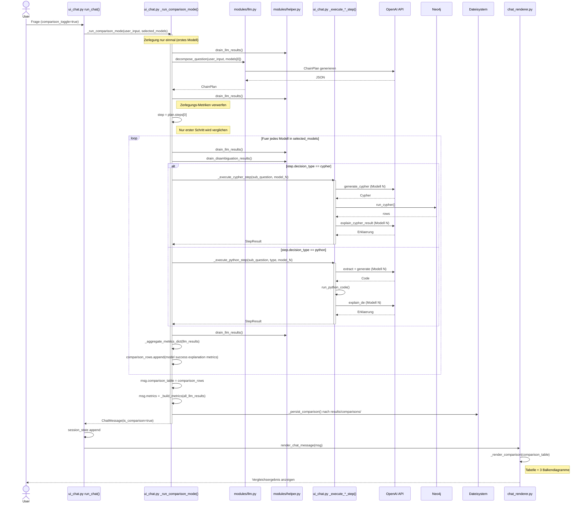

# Sequenzdiagramm: Modellvergleichsmodus

> **Quelle:** `app/ui_chat.py:442` (_run_comparison_mode)

```mermaid
sequenceDiagram
    actor User
    participant chat as ui_chat.py run_chat()
    participant comp as ui_chat.py _run_comparison_mode()
    participant llm as modules/llm.py
    participant helper as modules/helper.py
    participant exec as ui_chat.py _execute_*_step()
    participant openai as OpenAI API
    participant neo4j as Neo4j
    participant fs as Dateisystem
    participant renderer as chat_renderer.py

    User->>chat: Frage (comparison_toggle=true)
    chat->>comp: _run_comparison_mode(user_input, selected_models)
    activate comp

    Note over comp: Zerlegung nur einmal (erstes Modell)
    comp->>helper: drain_llm_results()
    comp->>llm: decompose_question(user_input, models[0])
    llm->>openai: ChainPlan generieren
    openai-->>llm: JSON
    llm-->>comp: ChainPlan
    comp->>helper: drain_llm_results()
    Note right of comp: Zerlegungs-Metriken verwerfen

    comp->>comp: step = plan.steps[0]
    Note right of comp: Nur erster Schritt wird verglichen

    loop Fuer jedes Modell in selected_models
        comp->>helper: drain_llm_results()
        comp->>helper: drain_disambiguation_results()

        alt step.decision_type == cypher
            comp->>exec: _execute_cypher_step(sub_question, model_N)
            activate exec
            exec->>openai: generate_cypher (Modell N)
            openai-->>exec: Cypher
            exec->>neo4j: run_cypher()
            neo4j-->>exec: rows
            exec->>openai: explain_cypher_result (Modell N)
            openai-->>exec: Erklaerung
            exec-->>comp: StepResult
            deactivate exec
        else step.decision_type == python
            comp->>exec: _execute_python_step(sub_question, type, model_N)
            activate exec
            exec->>openai: extract + generate (Modell N)
            openai-->>exec: Code
            exec->>exec: run_python_code()
            exec->>openai: explain_de (Modell N)
            openai-->>exec: Erklaerung
            exec-->>comp: StepResult
            deactivate exec
        end

        comp->>helper: drain_llm_results()
        comp->>comp: _aggregate_metrics_dict(llm_results)
        comp->>comp: comparison_rows.append(model success explanation metrics)
    end

    comp->>comp: msg.comparison_table = comparison_rows
    comp->>comp: msg.metrics = _build_metrics(all_llm_results)
    comp->>fs: _persist_comparison() nach results/comparisons/
    comp-->>chat: ChatMessage(is_comparison=true)
    deactivate comp

    chat->>chat: session_state append
    chat->>renderer: render_chat_message(msg)
    renderer->>renderer: _render_comparison(comparison_table)
    Note right of renderer: Tabelle + 3 Balkendiagramme
    renderer-->>User: Vergleichsergebnis anzeigen
```
