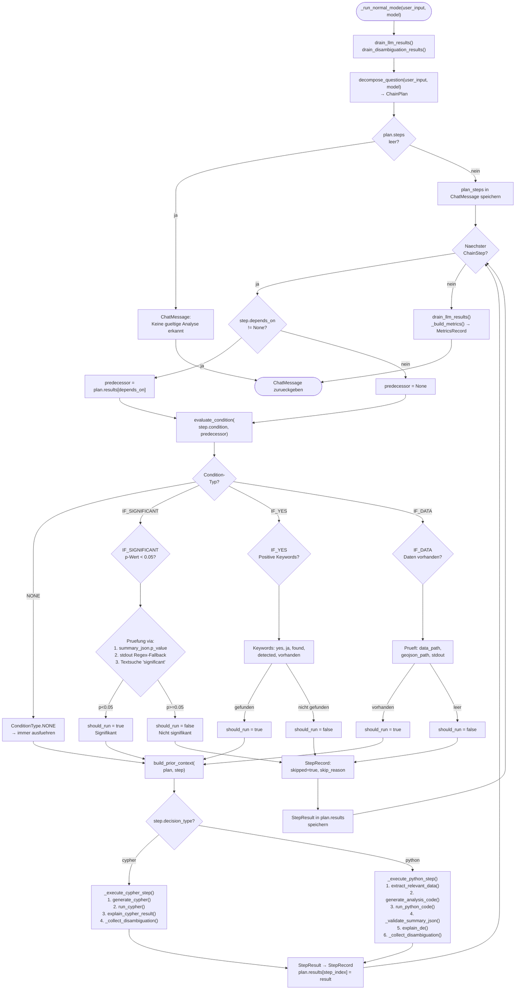

# Aktivitaetsdiagramm: Chain-Ausfuehrung mit bedingter Verzweigung

> **Quellen:** `app/ui_chat.py:294` (_run_normal_mode), `modules/chain.py:64` (evaluate_condition)

```mermaid
flowchart TD
    START(["_run_normal_mode(user_input, model)"])

    DRAIN["drain_llm_results()\ndrain_disambiguation_results()"]
    DECOMP["decompose_question(user_input, model)\n→ ChainPlan"]

    EMPTY{"plan.steps\nleer?"}
    FAIL_MSG["ChatMessage:\nKeine gueltige Analyse erkannt"]

    SAVE_PLAN["plan_steps in ChatMessage speichern"]

    LOOP{"Naechster\nChainStep?"}

    DEP{"step.depends_on\n!= None?"}
    GET_PRED["predecessor =\nplan.results[depends_on]"]
    NO_PRED["predecessor = None"]

    EVAL["evaluate_condition(\nstep.condition, predecessor)"]

    COND{"Condition-\nTyp?"}

    NONE_COND["ConditionType.NONE\n→ immer ausfuehren"]

    SIG_CHECK{"IF_SIGNIFICANT\np-Wert < 0.05?"}
    SIG_SRC{"Pruefung via:\n1. summary_json.p_value\n2. stdout Regex-Fallback\n3. Textsuche 'significant'"}
    SIG_OK["should_run = true\nSignifikant"]
    SIG_FAIL["should_run = false\nNicht signifikant"]

    YES_CHECK{"IF_YES\nPositive Keywords?"}
    YES_KW["Keywords: yes, ja, found,\ndetected, vorhanden"]
    YES_OK["should_run = true"]
    YES_FAIL["should_run = false"]

    DATA_CHECK{"IF_DATA\nDaten vorhanden?"}
    DATA_SRC["Prueft: data_path,\ngeojson_path, stdout"]
    DATA_OK["should_run = true"]
    DATA_FAIL["should_run = false"]

    SKIP["StepRecord:\nskipped=true, skip_reason"]
    SKIP_RES["StepResult in plan.results\nspeichern"]

    CONTEXT["build_prior_context(\nplan, step)"]
    DECIDE{"step.decision_type?"}

    CYPHER["_execute_cypher_step()\n1. generate_cypher()\n2. run_cypher()\n3. explain_cypher_result()\n4. _collect_disambiguation()"]

    PYTHON["_execute_python_step()\n1. extract_relevant_data()\n2. generate_analysis_code()\n3. run_python_code()\n4. _validate_summary_json()\n5. explain_de()\n6. _collect_disambiguation()"]

    RECORD["StepResult → StepRecord\nplan.results[step_index] = result"]

    METRICS["drain_llm_results()\n_build_metrics() → MetricsRecord"]
    RETURN(["ChatMessage zurueckgeben"])

    START --> DRAIN
    DRAIN --> DECOMP
    DECOMP --> EMPTY

    EMPTY -- ja --> FAIL_MSG
    FAIL_MSG --> RETURN

    EMPTY -- nein --> SAVE_PLAN
    SAVE_PLAN --> LOOP

    LOOP -- ja --> DEP
    LOOP -- nein --> METRICS

    DEP -- ja --> GET_PRED
    DEP -- nein --> NO_PRED
    GET_PRED --> EVAL
    NO_PRED --> EVAL

    EVAL --> COND

    COND -- NONE --> NONE_COND
    NONE_COND --> CONTEXT

    COND -- IF_SIGNIFICANT --> SIG_CHECK
    SIG_CHECK --> SIG_SRC
    SIG_SRC -- "p<0.05" --> SIG_OK
    SIG_SRC -- "p>=0.05" --> SIG_FAIL
    SIG_OK --> CONTEXT
    SIG_FAIL --> SKIP

    COND -- IF_YES --> YES_CHECK
    YES_CHECK --> YES_KW
    YES_KW -- gefunden --> YES_OK
    YES_KW -- nicht gefunden --> YES_FAIL
    YES_OK --> CONTEXT
    YES_FAIL --> SKIP

    COND -- IF_DATA --> DATA_CHECK
    DATA_CHECK --> DATA_SRC
    DATA_SRC -- vorhanden --> DATA_OK
    DATA_SRC -- leer --> DATA_FAIL
    DATA_OK --> CONTEXT
    DATA_FAIL --> SKIP

    SKIP --> SKIP_RES
    SKIP_RES --> LOOP

    CONTEXT --> DECIDE
    DECIDE -- cypher --> CYPHER
    DECIDE -- python --> PYTHON
    CYPHER --> RECORD
    PYTHON --> RECORD
    RECORD --> LOOP

    METRICS --> RETURN
```
