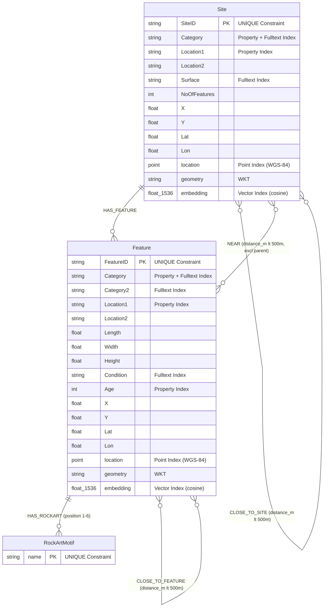

# ER-Diagramm: Neo4j-Graph-Schema

> **Quellen:** `modules/neo4j/neo4j_import.py:18`, `modules/neo4j/neo4j_import.py:159`, `modules/neo4j/neo4j_import.py:206`

```mermaid
erDiagram
    Site {
        string SiteID PK "UNIQUE Constraint"
        string Category "Property + Fulltext Index"
        string Location1 "Property Index"
        string Location2
        string Surface "Fulltext Index"
        int NoOfFeatures
        float X
        float Y
        float Lat
        float Lon
        point location "Point Index (WGS-84)"
        string geometry "WKT"
        float_1536 embedding "Vector Index (cosine)"
    }

    Feature {
        string FeatureID PK "UNIQUE Constraint"
        string Category "Property + Fulltext Index"
        string Category2 "Fulltext Index"
        string Location1 "Property Index"
        string Location2
        float Length
        float Width
        float Height
        string Condition "Fulltext Index"
        int Age "Property Index"
        float X
        float Y
        float Lat
        float Lon
        point location "Point Index (WGS-84)"
        string geometry "WKT"
        float_1536 embedding "Vector Index (cosine)"
    }

    RockArtMotif {
        string name PK "UNIQUE Constraint"
    }

    Site ||--o{ Feature : "HAS_FEATURE"
    Feature ||--o{ RockArtMotif : "HAS_ROCKART (position 1-6)"
    Site }o--o{ Site : "CLOSE_TO_SITE (distance_m lt 500m)"
    Feature }o--o{ Feature : "CLOSE_TO_FEATURE (distance_m lt 500m)"
    Feature }o--o{ Site : "NEAR (distance_m lt 500m, excl parent)"
```
