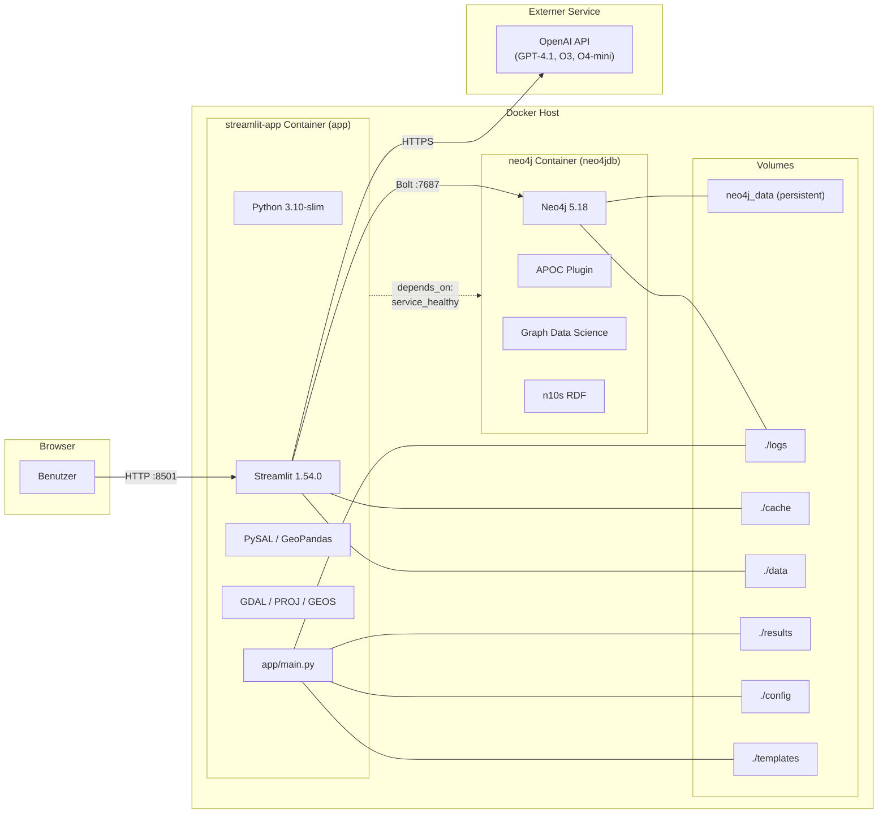

# Deployment-Diagramm: Docker-Compose-Architektur

> **Quellen:** `docker-compose.yml:3`, `Dockerfile`

```mermaid
flowchart LR
    subgraph Browser["Browser"]
        USER["Benutzer"]
    end

    subgraph DockerHost["Docker Host"]
        subgraph neo4j_container["neo4j Container (neo4jdb)"]
            NEO4J["Neo4j 5.18"]
            APOC["APOC Plugin"]
            GDS["Graph Data Science"]
            N10S["n10s RDF"]
        end

        subgraph streamlit_container["streamlit-app Container (app)"]
            PYTHON["Python 3.10-slim"]
            ST["Streamlit 1.54.0"]
            PYSAL["PySAL / GeoPandas"]
            GDAL["GDAL / PROJ / GEOS"]
            MAIN["app/main.py"]
        end

        subgraph volumes["Volumes"]
            V_NEO["neo4j_data (persistent)"]
            V_LOG["./logs"]
            V_CACHE["./cache"]
            V_DATA["./data"]
            V_RES["./results"]
            V_CFG["./config"]
            V_TPL["./templates"]
        end
    end

    subgraph External["Externer Service"]
        OPENAI["OpenAI API\n(GPT-4.1, O3, O4-mini)"]
    end

    USER -- "HTTP :8501" --> ST
    ST -- "Bolt :7687" --> NEO4J
    ST -- "HTTPS" --> OPENAI

    NEO4J --- V_NEO
    NEO4J --- V_LOG
    MAIN --- V_LOG
    MAIN --- V_RES
    MAIN --- V_CFG
    MAIN --- V_TPL
    ST --- V_CACHE
    ST --- V_DATA

    streamlit_container -. "depends_on:\nservice_healthy" .-> neo4j_container
```
