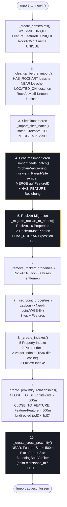

# Aktivitaetsdiagramm: Neo4j-Import-Pipeline

> **Quelle:** `modules/neo4j/neo4j_import.py:325` (import_to_neo4j)

```mermaid
flowchart TD
    START(["import_to_neo4j()"])

    CONST["1. _create_constraints()\nSite.SiteID UNIQUE\nFeature.FeatureID UNIQUE\nRockArtMotif.name UNIQUE"]

    CLEAN["2. _cleanup_before_import()\nHAS_ROCKART loeschen\nNEAR loeschen\nLOCATED_ON loeschen\nRockArtMotif-Knoten loeschen"]

    SITES["3. Sites importieren\n_import_sites_batch()\nBatch-Groesse: 1000\nMERGE auf SiteID"]

    FEATS["4. Features importieren\n_import_feats_batch()\nOrphan-Validierung:\nnur wenn Parent-Site existiert\nMERGE auf FeatureID\n+ HAS_FEATURE-Beziehung"]

    ROCK["5. RockArt-Migration\n_migrate_rockart_to_nodes()\nRockArt1-6 Properties\n-> RockArtMotif-Knoten\n+ HAS_ROCKART (position 1-6)"]

    ROCKRM["6. _remove_rockart_properties()\nRockArt1-6 von Features entfernen"]

    POINT["7. _set_point_properties()\nLat/Lon -> Neo4j point(WGS-84)\nSites + Features"]

    IDX["8. _create_indexes()\n5 Property-Indexe\n2 Point-Indexe\n2 Vektor-Indexe (1536-dim, cosine)\n2 Fulltext-Indexe"]

    PROX["9. _create_proximity_relationships()\nCLOSE_TO_SITE: Site-Site < 500m\nCLOSE_TO_FEATURE: Feature-Feature < 500m\nUndirected (a.ID < b.ID)"]

    CROSS["10. _create_cross_proximity()\nNEAR: Feature-Site < 500m\nExcl. Parent-Site\nBoundingBox-Vorfilter\n(delta = distance_m / 111000)"]

    DONE(["Import abgeschlossen"])

    START --> CONST
    CONST --> CLEAN
    CLEAN --> SITES
    SITES --> FEATS
    FEATS --> ROCK
    ROCK --> ROCKRM
    ROCKRM --> POINT
    POINT --> IDX
    IDX --> PROX
    PROX --> CROSS
    CROSS --> DONE

    style FEATS fill:#1a1d26,stroke:#D4A853,color:#FAFAFA
    style ROCK fill:#1a1d26,stroke:#D4A853,color:#FAFAFA
    style CROSS fill:#1a1d26,stroke:#D4A853,color:#FAFAFA
```
