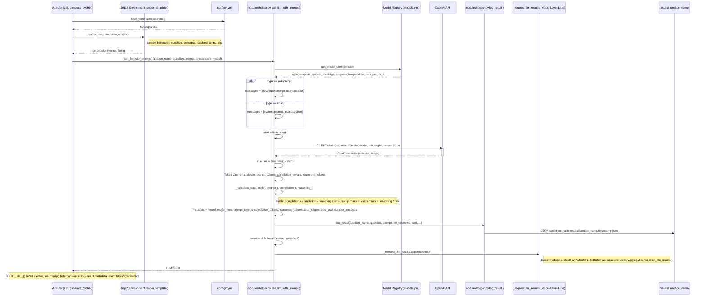

# Sequenzdiagramm: LLM-Aufruf-Pipeline mit dualem Return-Mechanismus

> **Quelle:** `modules/helper.py:180` (call_llm_with_prompt)

```mermaid
sequenceDiagram
    participant caller as Aufrufer (z.B. generate_cypher)
    participant template as Jinja2 Environment render_template()
    participant config as config/*.yml
    participant helper as modules/helper.py call_llm_with_prompt()
    participant registry as Model Registry (models.yml)
    participant openai as OpenAI API
    participant log as modules/logger.py log_result()
    participant buffer as _request_llm_results (Modul-Level-Liste)
    participant results as results/ function_name/

    caller->>config: load_yaml("concepts.yml")
    config-->>caller: concepts dict

    caller->>template: render_template(name, context)
    Note right of template: context beinhaltet: question, concepts, resolved_terms, etc.
    template-->>caller: gerendeter Prompt-String

    caller->>helper: call_llm_with_prompt( function_name, question, prompt, temperature, model)
    activate helper

    helper->>registry: get_model_config(model)
    registry-->>helper: type, supports_system_message, supports_temperature, cost_per_1k_*

    alt type == reasoning
        helper->>helper: messages = [developer:prompt, user:question]
    else type == chat
        helper->>helper: messages = [system:prompt, user:question]
    end

    helper->>helper: start = time.time()
    helper->>openai: CLIENT.chat.completions.create( model, messages, temperature)
    activate openai
    openai-->>helper: ChatCompletion(choices, usage)
    deactivate openai
    helper->>helper: duration = time.time() - start

    helper->>helper: Token-Zaehler auslesen: prompt_tokens, completion_tokens, reasoning_tokens

    helper->>helper: _calculate_cost( model, prompt_t, completion_t, reasoning_t)
    Note right of helper: visible_completion = completion - reasoning cost = prompt * rate + visible * rate + reasoning * rate

    helper->>helper: metadata = model, model_type, prompt_tokens, completion_tokens, reasoning_tokens, total_tokens, cost_usd, duration_seconds

    helper->>log: log_result(function_name, question, prompt, llm_response, cost, ...)
    log->>results: JSON speichern nach results/function_name/timestamp.json

    helper->>helper: result = LLMResult(answer, metadata)
    helper->>buffer: _request_llm_results.append(result)
    Note right of buffer: Dualer Return: 1. Direkt an Aufrufer 2. In Buffer fuer spaetere Metrik-Aggregation via drain_llm_results()
    helper-->>caller: LLMResult
    deactivate helper

    Note over caller: result.__str__() liefert answer, result.strip() liefert answer.strip(), result.metadata liefert Token/Kosten-Dict
```
