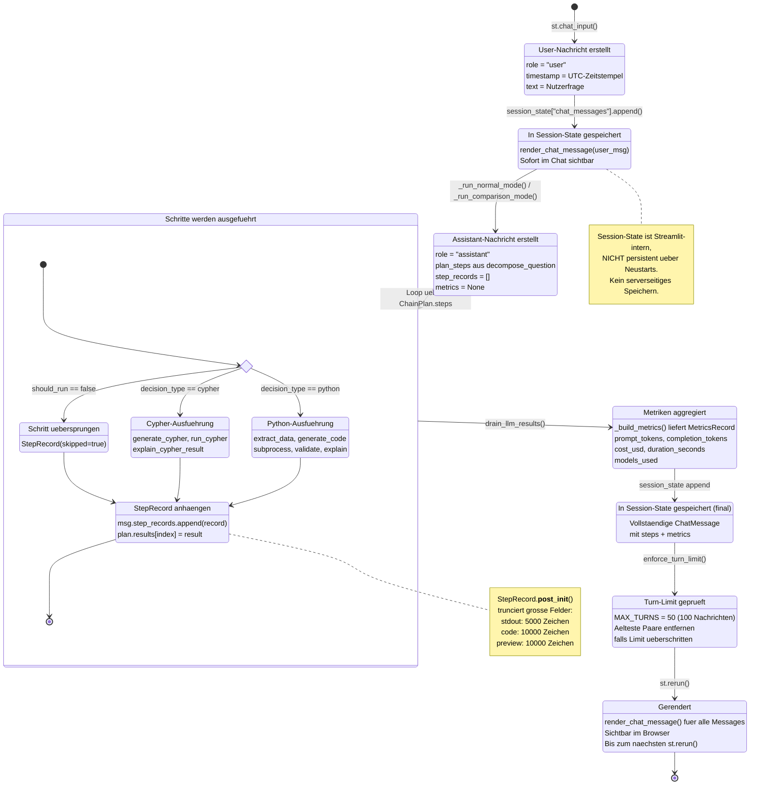

# Zustandsdiagramm: ChatMessage-Lebenszyklus

> **Quellen:** `app/ui_chat.py:519` (run_chat), `app/chat_models.py:92` (ChatMessage)

```mermaid
stateDiagram-v2
    direction TB

    [*] --> UserCreated: st.chat_input()

    state "User-Nachricht erstellt" as UserCreated
    UserCreated: role = "user"
    UserCreated: timestamp = UTC-Zeitstempel
    UserCreated: text = Nutzerfrage

    UserCreated --> UserAppended: session_state["chat_messages"].append()

    state "In Session-State gespeichert" as UserAppended
    UserAppended: render_chat_message(user_msg)
    UserAppended: Sofort im Chat sichtbar

    UserAppended --> AssistantCreated: _run_normal_mode() / _run_comparison_mode()

    state "Assistant-Nachricht erstellt" as AssistantCreated
    AssistantCreated: role = "assistant"
    AssistantCreated: plan_steps aus decompose_question
    AssistantCreated: step_records = []
    AssistantCreated: metrics = None

    AssistantCreated --> StepsExecuting: Loop ueber ChainPlan.steps

    state "Schritte werden ausgefuehrt" as StepsExecuting {
        state evaluate <<choice>>
        [*] --> evaluate

        evaluate --> StepSkipped: should_run == false
        evaluate --> CypherExec: decision_type == cypher
        evaluate --> PythonExec: decision_type == python

        state "Schritt uebersprungen" as StepSkipped
        StepSkipped: StepRecord(skipped=true)

        state "Cypher-Ausfuehrung" as CypherExec
        CypherExec: generate_cypher, run_cypher
        CypherExec: explain_cypher_result

        state "Python-Ausfuehrung" as PythonExec
        PythonExec: extract_data, generate_code
        PythonExec: subprocess, validate, explain

        StepSkipped --> RecordAppend
        CypherExec --> RecordAppend
        PythonExec --> RecordAppend

        state "StepRecord anhaengen" as RecordAppend
        RecordAppend: msg.step_records.append(record)
        RecordAppend: plan.results[index] = result

        RecordAppend --> [*]

        note right of RecordAppend
            StepRecord.__post_init__()
            trunciert grosse Felder:
            stdout: 5000 Zeichen
            code: 10000 Zeichen
            preview: 10000 Zeichen
        end note
    }

    StepsExecuting --> MetricsCollected: drain_llm_results()

    state "Metriken aggregiert" as MetricsCollected
    MetricsCollected: _build_metrics() liefert MetricsRecord
    MetricsCollected: prompt_tokens, completion_tokens
    MetricsCollected: cost_usd, duration_seconds
    MetricsCollected: models_used

    MetricsCollected --> AssistantAppended: session_state append

    state "In Session-State gespeichert (final)" as AssistantAppended
    AssistantAppended: Vollstaendige ChatMessage
    AssistantAppended: mit steps + metrics

    AssistantAppended --> TurnLimitEnforced: enforce_turn_limit()

    state "Turn-Limit geprueft" as TurnLimitEnforced
    TurnLimitEnforced: MAX_TURNS = 50 (100 Nachrichten)
    TurnLimitEnforced: Aelteste Paare entfernen
    TurnLimitEnforced: falls Limit ueberschritten

    TurnLimitEnforced --> Rendered: st.rerun()

    state "Gerendert" as Rendered
    Rendered: render_chat_message() fuer alle Messages
    Rendered: Sichtbar im Browser
    Rendered: Bis zum naechsten st.rerun()

    Rendered --> [*]

    note right of UserAppended
        Session-State ist Streamlit-intern,
        NICHT persistent ueber Neustarts.
        Kein serverseitiges Speichern.
    end note
```
