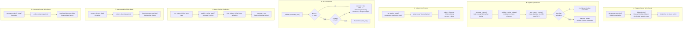

# Fehlerbehandlungs-Fluesse

> **Quellen:** `app/ui_chat.py:159-288`, `modules/llm.py`, `modules/disambiguator.py:278-317`

```mermaid
flowchart TD
    subgraph A["A: Fragezerlegung fehlschlaegt"]
        A1["decompose_question()\nJSON-Parse-Fehler"]
        A2["_fallback_plan()\nEinzelschritt-Klassifikation\nvia classify_analysis_type"]
        A3["ChainPlan mit einem Schritt"]
        A1 --> A2 --> A3
    end

    subgraph B["B: Cypher-Syntaxfehler"]
        B1["generate_cypher()\nLLM erzeugt fehlerhaften Cypher"]
        B2["validate_cypher_values()\nUnbekannte Werte erkennen"]
        B3["auto_correct_cypher()\nFuzzy-Matching via difflib\n(cutoff=0.7)"]
        B4{"Korrektur\ngefunden?"}
        B5["Korrigierten Cypher verwenden"]
        B6["Warnung loggen\nOriginal-Cypher verwenden"]
        B1 --> B2 --> B3 --> B4
        B4 -- ja --> B5
        B4 -- nein --> B6
    end

    subgraph C["C: Subprocess-Timeout"]
        C1["run_python_code()\nsubprocess.run(timeout=900)"]
        C2["subprocess.TimeoutExpired"]
        C3["stderr = Timeout-Fehlermeldung\nsuccess = false"]
        C1 --> C2 --> C3
    end

    subgraph D["D: NaN in Statistik"]
        D1["_validate_summary_json()"]
        D2{"Moran's I\n== NaN?"}
        D3{"p_value\n== NaN?"}
        D4["success = false\nstderr += Validierungswarnung\nErklarung = fehlgeschlagen"]
        D5["Weiter mit explain_de()"]
        D1 --> D2
        D2 -- ja --> D4
        D2 -- nein --> D3
        D3 -- ja --> D4
        D3 -- nein --> D5
    end

    subgraph E["E: Leere Cypher-Ergebnisse"]
        E1["run_cypher() liefert leere Liste"]
        E2["explain_cypher_result()\nmit leerer Preview"]
        E3["LLM erklaert: Keine Daten gefunden"]
        E4["success = true\n(kein technischer Fehler)"]
        E1 --> E2 --> E3 --> E4
    end

    subgraph F["F: Datenextraktion fehlschlaegt"]
        F1["extract_relevant_data()\nException"]
        F2["_collect_disambiguation()"]
        F3["StepResult(success=false)\nFruehzeitiger Return"]
        F1 --> F2 --> F3
    end

    subgraph G["G: Codegenerierung fehlschlaegt"]
        G1["generate_analysis_code()\nException"]
        G2["_collect_disambiguation()"]
        G3["StepResult(success=false)\nFruehzeitiger Return"]
        G1 --> G2 --> G3
    end
```
