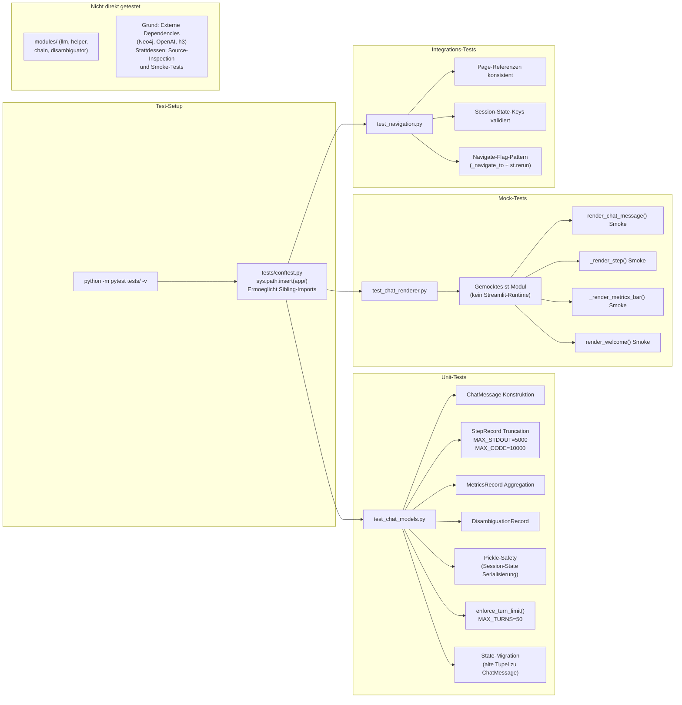

# Test-Architektur und -Strategie

> **Quellen:** `tests/conftest.py`, `tests/test_chat_models.py`, `tests/test_chat_renderer.py`, `tests/test_navigation.py`

```mermaid
flowchart LR
    subgraph Setup["Test-Setup"]
        CONFTEST["tests/conftest.py\nsys.path.insert(app/)\nErmoeglicht Sibling-Imports"]
        PYTEST["python -m pytest tests/ -v"]
    end

    subgraph UnitTests["Unit-Tests"]
        TCM["test_chat_models.py"]
        TCM_1["ChatMessage Konstruktion"]
        TCM_2["StepRecord Truncation\nMAX_STDOUT=5000\nMAX_CODE=10000"]
        TCM_3["MetricsRecord Aggregation"]
        TCM_4["DisambiguationRecord"]
        TCM_5["Pickle-Safety\n(Session-State Serialisierung)"]
        TCM_6["enforce_turn_limit()\nMAX_TURNS=50"]
        TCM_7["State-Migration\n(alte Tupel zu ChatMessage)"]
    end

    subgraph MockTests["Mock-Tests"]
        TCR["test_chat_renderer.py"]
        TCR_1["Gemocktes st-Modul\n(kein Streamlit-Runtime)"]
        TCR_2["render_chat_message() Smoke"]
        TCR_3["_render_step() Smoke"]
        TCR_4["_render_metrics_bar() Smoke"]
        TCR_5["render_welcome() Smoke"]
    end

    subgraph IntegTests["Integrations-Tests"]
        TNV["test_navigation.py"]
        TNV_1["Page-Referenzen konsistent"]
        TNV_2["Session-State-Keys validiert"]
        TNV_3["Navigate-Flag-Pattern\n(_navigate_to + st.rerun)"]
    end

    subgraph NotTested["Nicht direkt getestet"]
        MOD["modules/ (llm, helper,\nchain, disambiguator)"]
        REASON["Grund: Externe Dependencies\n(Neo4j, OpenAI, h3)\nStattdessen: Source-Inspection\nund Smoke-Tests"]
    end

    CONFTEST --> TCM
    CONFTEST --> TCR
    CONFTEST --> TNV
    PYTEST --> CONFTEST

    TCM --> TCM_1
    TCM --> TCM_2
    TCM --> TCM_3
    TCM --> TCM_4
    TCM --> TCM_5
    TCM --> TCM_6
    TCM --> TCM_7

    TCR --> TCR_1
    TCR_1 --> TCR_2
    TCR_1 --> TCR_3
    TCR_1 --> TCR_4
    TCR_1 --> TCR_5

    TNV --> TNV_1
    TNV --> TNV_2
    TNV --> TNV_3
```
