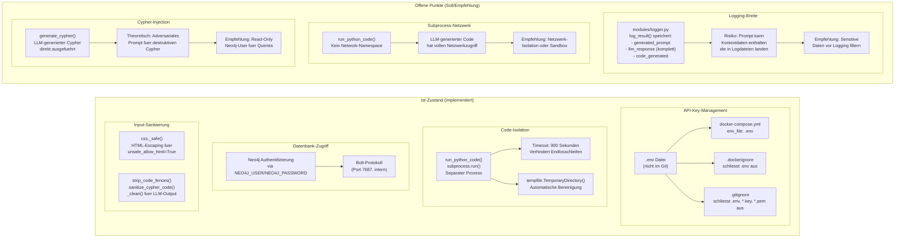

# Sicherheitsarchitektur: Ist-Zustand und offene Punkte

> **Quellen:** `docker-compose.yml`, `Dockerfile`, `.dockerignore`, `modules/logger.py:79`

```mermaid
flowchart LR
    subgraph IST["Ist-Zustand (implementiert)"]
        direction TB

        subgraph S1["API-Key-Management"]
            ENV[".env Datei\n(nicht im Git)"]
            DOCKER["docker-compose.yml\nenv_file: .env"]
            NOIMG[".dockerignore\nschliesst .env aus"]
            GITIGN[".gitignore\nschliesst .env, *.key, *.pem aus"]
            ENV --> DOCKER
            ENV --> NOIMG
            ENV --> GITIGN
        end

        subgraph S2["Code-Isolation"]
            SUB["run_python_code()\nsubprocess.run()\nSeparater Prozess"]
            TIMEOUT["Timeout: 900 Sekunden\nVerhindert Endlosschleifen"]
            TEMP["tempfile.TemporaryDirectory()\nAutomatische Bereinigung"]
            SUB --> TIMEOUT
            SUB --> TEMP
        end

        subgraph S3["Datenbank-Zugriff"]
            NEO4J_AUTH["Neo4j Authentifizierung\nvia NEO4J_USER/NEO4J_PASSWORD"]
            BOLT["Bolt-Protokoll\n(Port 7687, intern)"]
            NEO4J_AUTH --> BOLT
        end

        subgraph S4["Input-Sanitaerung"]
            SAFE["css._safe()\nHTML-Escaping fuer\nunsafe_allow_html=True"]
            STRIP["strip_code_fences()\nsanitize_cypher_code()\n_clean() fuer LLM-Output"]
        end
    end

    subgraph SOLL["Offene Punkte (Soll/Empfehlung)"]
        direction TB

        subgraph O1["Logging-Breite"]
            LOG["modules/logger.py\nlog_result() speichert:\n- generated_prompt\n- llm_response (komplett)\n- code_generated"]
            RISK1["Risiko: Prompt kann\nKontextdaten enthalten\ndie in Logdateien landen"]
            REC1["Empfehlung: Sensitive\nDaten vor Logging filtern"]
            LOG --> RISK1 --> REC1
        end

        subgraph O2["Subprocess-Netzwerk"]
            NET["run_python_code()\nKein Network-Namespace"]
            RISK2["LLM-generierter Code\nhat vollen Netzwerkzugriff"]
            REC2["Empfehlung: Netzwerk-\nIsolation oder Sandbox"]
            NET --> RISK2 --> REC2
        end

        subgraph O3["Cypher-Injection"]
            CYP["generate_cypher()\nLLM-generierter Cypher\ndirekt ausgefuehrt"]
            RISK3["Theoretisch: Adversariales\nPrompt fuer destruktiven Cypher"]
            REC3["Empfehlung: Read-Only\nNeo4j-User fuer Queries"]
            CYP --> RISK3 --> REC3
        end
    end
```
