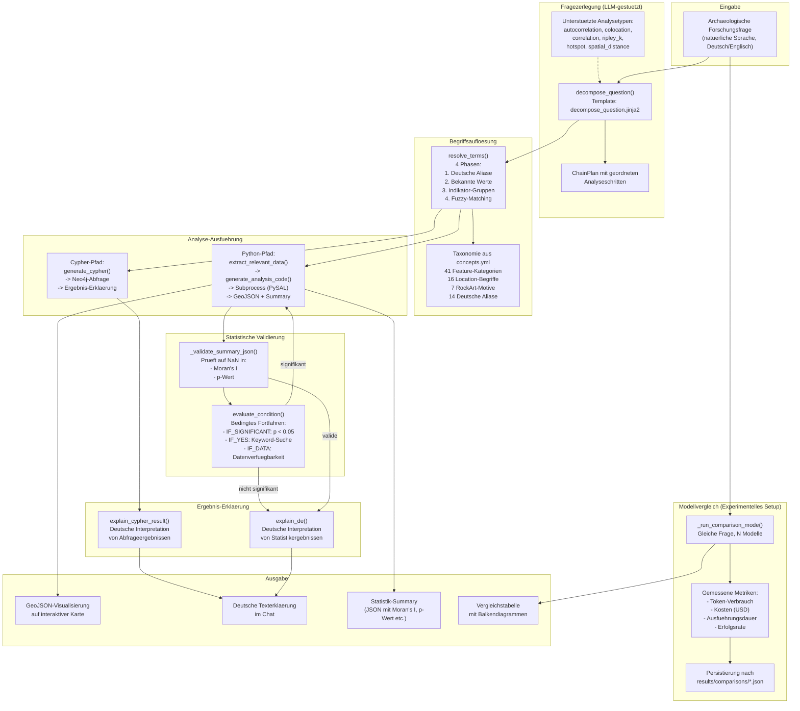

# Forschungsmethodik

> **Quellen:** `templates/system/*.jinja2`, `app/ui_chat.py:442`, `config/analysis_patterns.yml`

```mermaid
flowchart TD
    subgraph Input["Eingabe"]
        Q["Archaeologische Forschungsfrage\n(natuerliche Sprache, Deutsch/Englisch)"]
    end

    subgraph Decomposition["Fragezerlegung (LLM-gestuetzt)"]
        DEC["decompose_question()\nTemplate: decompose_question.jinja2"]
        PLAN["ChainPlan mit geordneten\nAnalyseschritten"]
        PATTERNS["Unterstuetzte Analysetypen:\nautocorrelation, colocation,\ncorrelation, ripley_k,\nhotspot, spatial_distance"]
        DEC --> PLAN
        PATTERNS -.-> DEC
    end

    subgraph Disambiguation["Begriffsaufloesung"]
        RES["resolve_terms()\n4 Phasen:\n1. Deutsche Aliase\n2. Bekannte Werte\n3. Indikator-Gruppen\n4. Fuzzy-Matching"]
        TAX["Taxonomie aus concepts.yml\n41 Feature-Kategorien\n16 Location-Begriffe\n7 RockArt-Motive\n14 Deutsche Aliase"]
        RES --> TAX
    end

    subgraph Execution["Analyse-Ausfuehrung"]
        direction TB
        CYPHER_PATH["Cypher-Pfad:\ngenerate_cypher()\n-> Neo4j-Abfrage\n-> Ergebnis-Erklaerung"]
        PYTHON_PATH["Python-Pfad:\nextract_relevant_data()\n-> generate_analysis_code()\n-> Subprocess (PySAL)\n-> GeoJSON + Summary"]
    end

    subgraph Validation["Statistische Validierung"]
        VAL["_validate_summary_json()\nPrueft auf NaN in:\n- Moran's I\n- p-Wert"]
        COND["evaluate_condition()\nBedingtes Fortfahren:\n- IF_SIGNIFICANT: p < 0.05\n- IF_YES: Keyword-Suche\n- IF_DATA: Datenverfuegbarkeit"]
    end

    subgraph Explanation["Ergebnis-Erklaerung"]
        EXP_CYP["explain_cypher_result()\nDeutsche Interpretation\nvon Abfrageergebnissen"]
        EXP_PY["explain_de()\nDeutsche Interpretation\nvon Statistikergebnissen"]
    end

    subgraph Comparison["Modellvergleich (Experimentelles Setup)"]
        COMP["_run_comparison_mode()\nGleiche Frage, N Modelle"]
        METRICS["Gemessene Metriken:\n- Token-Verbrauch\n- Kosten (USD)\n- Ausfuehrungsdauer\n- Erfolgsrate"]
        PERSIST["Persistierung nach\nresults/comparisons/*.json"]
        COMP --> METRICS --> PERSIST
    end

    subgraph Output["Ausgabe"]
        VIS["GeoJSON-Visualisierung\nauf interaktiver Karte"]
        TEXT["Deutsche Texterklaerung\nim Chat"]
        STATS["Statistik-Summary\n(JSON mit Moran's I, p-Wert etc.)"]
        TABLE["Vergleichstabelle\nmit Balkendiagrammen"]
    end

    Q --> DEC
    DEC --> RES
    RES --> CYPHER_PATH
    RES --> PYTHON_PATH
    CYPHER_PATH --> EXP_CYP
    PYTHON_PATH --> VAL
    VAL --> COND
    COND -- signifikant --> PYTHON_PATH
    COND -- nicht signifikant --> EXP_PY
    VAL -- valide --> EXP_PY
    EXP_CYP --> TEXT
    EXP_PY --> TEXT
    PYTHON_PATH --> VIS
    PYTHON_PATH --> STATS
    Q --> COMP
    COMP --> TABLE
```
