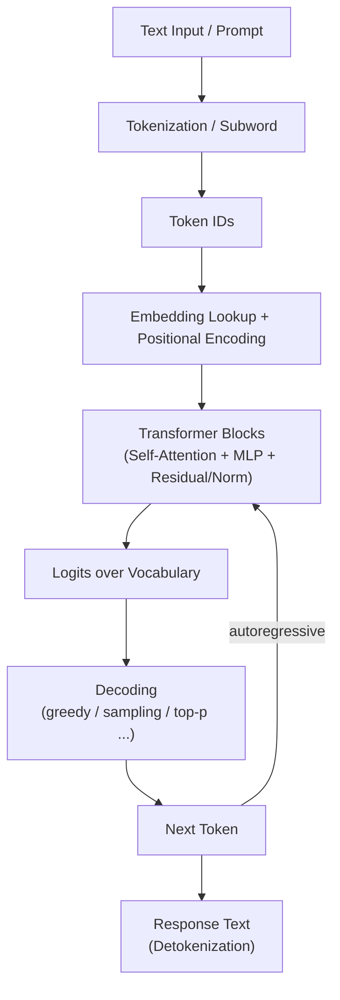

# Algorithm Flow of an LLM

> Shows the autoregressive generation process of a Large Language Model from text input to completed response.

```mermaid
flowchart TD
  A[Text Input / Prompt] --> B[Tokenization / Subword]
  B --> C[Token IDs]
  C --> D[Embedding Lookup + Positional Encoding]
  D --> E["Transformer Blocks<br/>(Self-Attention + MLP + Residual/Norm)"]
  E --> F[Logits over Vocabulary]
  F --> G["Decoding<br/>(greedy / sampling / top-p ...)"]
  G --> H[Next Token]
  H -->|autoregressive| E
  H --> I["Response Text<br/>(Detokenization)"]
```
