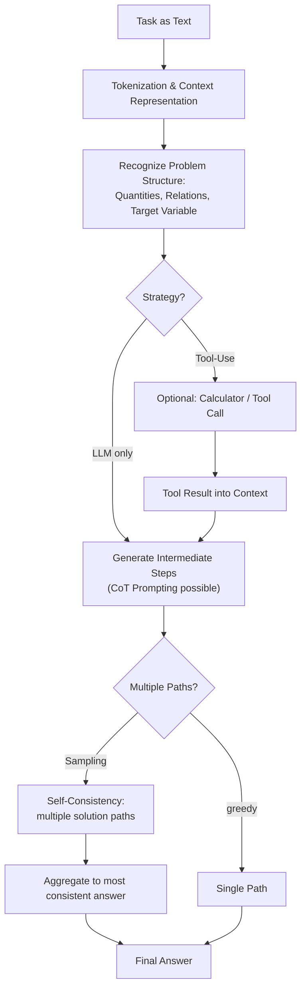

# How an LLM Solves a Math Word Problem

> Illustrates different strategies (Chain-of-Thought, Self-Consistency, Tool-Use) that an LLM can employ to solve mathematical word problems.

```mermaid
flowchart TD
  A[Task as Text] --> B[Tokenization & Context Representation]
  B --> C["Recognize Problem Structure:<br/>Quantities, Relations, Target Variable"]
  C --> D{Strategy?}
  D -->|LLM only| E["Generate Intermediate Steps<br/>(CoT Prompting possible)"]
  D -->|Tool-Use| F[Optional: Calculator / Tool Call]
  E --> G{Multiple Paths?}
  G -->|Sampling| H["Self-Consistency:<br/>multiple solution paths"]
  H --> I[Aggregate to most consistent answer]
  G -->|greedy| J[Single Path]
  F --> K[Tool Result into Context]
  K --> E
  I --> L[Final Answer]
  J --> L
```
