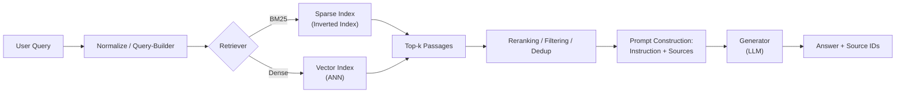

# How RAG Works

> Retrieval-Augmented Generation: From user query through hybrid retrieval (BM25 + Dense) to a generated answer with source references.

```mermaid
flowchart LR
  Q[User Query] --> N[Normalize / Query-Builder]
  N --> R{Retriever}
  R -->|BM25| S["Sparse Index<br/>(Inverted Index)"]
  R -->|Dense| V["Vector Index<br/>(ANN)"]
  S --> K[Top-k Passages]
  V --> K
  K --> RR[Reranking / Filtering / Dedup]
  RR --> P["Prompt Construction:<br/>Instruction + Sources"]
  P --> G["Generator<br/>(LLM)"]
  G --> A[Answer + Source IDs]
```
