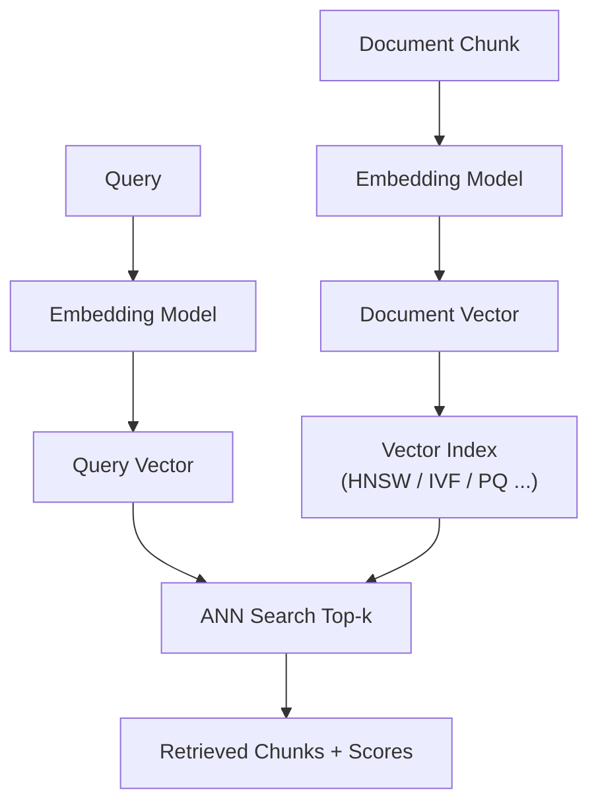

# Role of Embeddings and Vector DBs

> Shows how document chunks and queries are converted into vectors and efficiently matched via Approximate Nearest Neighbor (ANN) search.

```mermaid
flowchart TD
  D[Document Chunk] --> E1[Embedding Model]
  Q[Query] --> E2[Embedding Model]
  E1 --> V1[Document Vector]
  E2 --> V2[Query Vector]
  V1 --> IDX["Vector Index<br/>(HNSW / IVF / PQ ...)"]
  V2 --> ANN[ANN Search Top-k]
  IDX --> ANN
  ANN --> RES[Retrieved Chunks + Scores]
```
