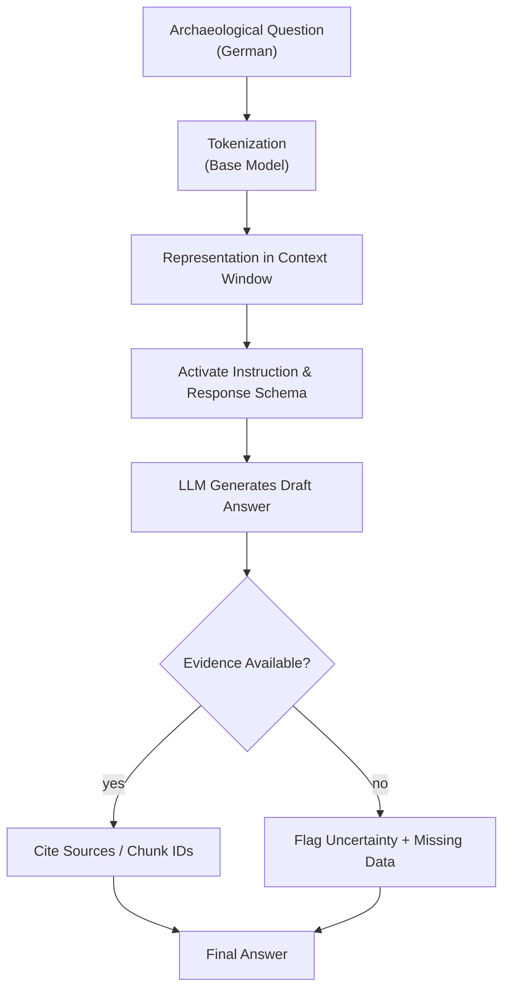

# LLM Algorithm Flow for Archaeological Use

> Adapted LLM flow for archaeological applications: question in German, instruction schema, evidence checking, and transparent handling of missing data.

