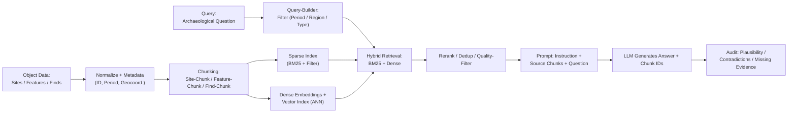

# RAG Pipeline for Wadi Abu Dom Features & Sites

> Domain-specific RAG pipeline: Archaeological object data (Sites, Features, Finds) are normalized, indexed, and queried via hybrid retrieval with quality audit.

