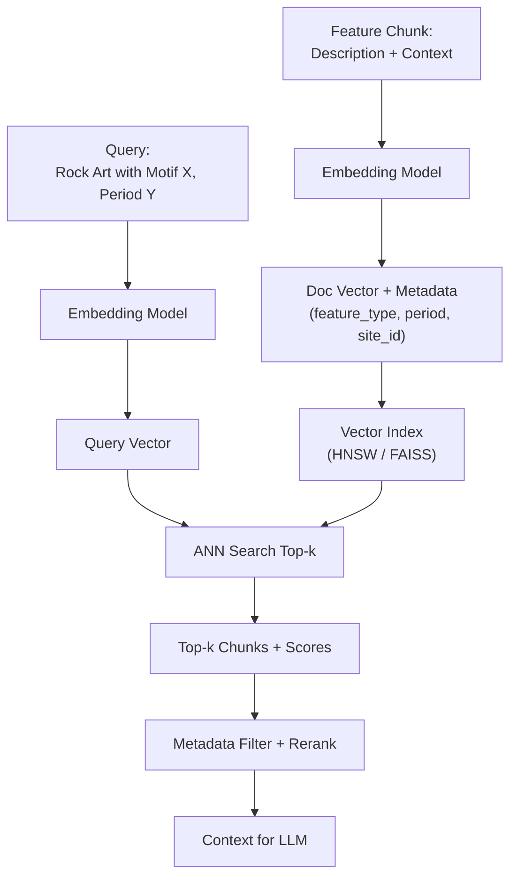

# Embeddings & Vector DBs for Archaeological Chunks

> Domain-adapted: Feature chunks with archaeological metadata are embedded, searched via ANN, and refined through metadata filtering.

```mermaid
flowchart TD
  A["Feature Chunk:<br/>Description + Context"] --> B[Embedding Model]
  C["Query:<br/>Rock Art with Motif X, Period Y"] --> D[Embedding Model]
  B --> E["Doc Vector + Metadata<br/>(feature_type, period, site_id)"]
  D --> F[Query Vector]
  E --> G["Vector Index<br/>(HNSW / FAISS)"]
  F --> H[ANN Search Top-k]
  G --> H
  H --> I[Top-k Chunks + Scores]
  I --> J[Metadata Filter + Rerank]
  J --> K[Context for LLM]
```
