# Activity Diagram -- Data Import Pipeline

Shows the four-stage ETL pipeline that transforms a GeoPackage file into
a populated Neo4j knowledge graph with embeddings and proximity edges.

```mermaid
flowchart TD
    Start([Start Import])

    subgraph S1 [Stage 1: GeoPackage to DuckDB]
        S1A[Read Sites + Features layers]
        S1B[Drop NaN coordinates]
        S1C[Remove duplicate IDs]
        S1D[Filter orphan Features]
        S1E[Coerce numeric types]
        S1F[Reproject UTM to WGS-84]
        S1G[Calculate Lat/Lon]
        S1H[Write Parquet cache]
        S1I[Create DuckDB tables]
    end

    subgraph S2 [Stage 2: Generate Embeddings]
        S2A[Load Sites + Features<br/>from DuckDB]
        S2B[Concatenate text fields]
        S2C{SHA256 in cache?}
        S2D[Call OpenAI API<br/>text-embedding-3-small]
        S2E[Read from cache]
        S2F[Store in embedding cache]
        S2G[Update DuckDB tables]
    end

    subgraph S3 [Stage 3: Export CSV]
        S3A[COPY Sites to CSV]
        S3B[COPY Features to CSV]
    end

    subgraph S4 [Stage 4: Neo4j Import]
        S4A[Create uniqueness constraints]
        S4B[Cleanup old relationships]
        S4C[Batch MERGE Site nodes]
        S4D[Batch MERGE Feature nodes<br/>+ HAS_FEATURE edges]
        S4E[Migrate RockArt1-6<br/>to RockArtMotif nodes]
        S4F[Set point properties]
        S4G[Create indexes<br/>property, point, vector, fulltext]
        S4H[Compute CLOSE_TO_SITE<br/>and CLOSE_TO_FEATURE]
        S4I[Compute NEAR<br/>Feature to non-parent Site]
    end

    End([Import Complete])

    Start --> S1A
    S1A --> S1B --> S1C --> S1D --> S1E --> S1F --> S1G --> S1H --> S1I

    S1I --> S2A
    S2A --> S2B --> S2C
    S2C -- No --> S2D --> S2F --> S2G
    S2C -- Yes --> S2E --> S2G

    S2G --> S3A
    S3A --> S3B

    S3B --> S4A
    S4A --> S4B --> S4C --> S4D --> S4E --> S4F --> S4G --> S4H --> S4I

    S4I --> End
```

## Pipeline Characteristics

| Stage | Module | Input | Output |
|-------|--------|-------|--------|
| 1 | `gpkg_to_duckdb.py` | `.gpkg` file | DuckDB tables, Parquet cache |
| 2 | `generate_embeddings.py` | DuckDB tables | DuckDB tables with 1536-dim vectors |
| 3 | `export_csv.py` | DuckDB tables | `sites_vec.csv`, `feat_vec.csv` |
| 4 | `neo4j_import.py` | CSV files | Neo4j graph with nodes, edges, indexes |

## Proximity Computation

- Distance threshold: 500 m (configurable)
- Uses Neo4j `point.distance()` on WGS-84 point properties
- Bounding-box pre-filter for cross-proximity (performance)
- Batch size: 1000 rows per transaction
