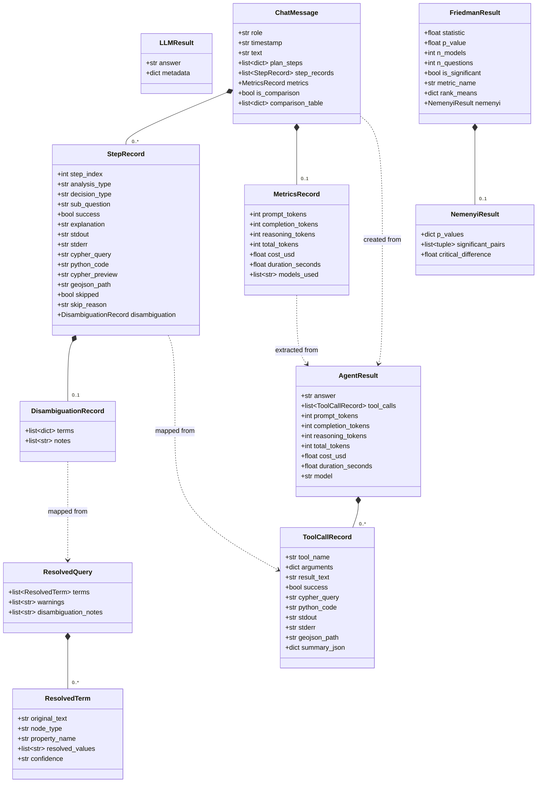

# Class Diagram -- Domain Model and Dataclasses

Shows all dataclasses, their attributes, and relationships across the
`modules/` and `app/` layers. Arrows denote composition (diamond) or
usage (dashed).

## Module Ownership

| Class              | Module                |
|--------------------|-----------------------|
| AgentResult        | `modules/helper.py`   |
| ToolCallRecord     | `modules/helper.py`   |
| LLMResult          | `modules/helper.py`   |
| ResolvedQuery      | `modules/disambiguator.py` |
| ResolvedTerm       | `modules/disambiguator.py` |
| ChatMessage        | `app/chat_models.py`  |
| StepRecord         | `app/chat_models.py`  |
| MetricsRecord      | `app/chat_models.py`  |
| DisambiguationRecord | `app/chat_models.py` |
| FriedmanResult     | `modules/statistics.py` |
| NemenyiResult      | `modules/statistics.py` |
