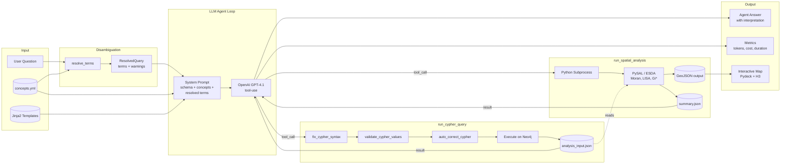

# Data Flow Diagram -- Query Processing Pipeline

Shows how data flows through the system when a user submits a research
question, from input through LLM reasoning to statistical output.

## Data Artifacts

| Artifact | Format | Path | Purpose |
|----------|--------|------|---------|
| analysis_input.json | JSON array | `results/` | Cypher query results for spatial analysis |
| summary.json | JSON object | `results/visualisierung/{type}/` | Statistical results (Moran's I, p-value, n) |
| output.geojson | GeoJSON | `results/visualisierung/{type}/` | Spatial features for map visualization |
| query result | JSON | `results/queries/{ts}.json` | Persisted full query record with steps and metrics |
| comparison | JSON + CSV | `results/comparisons/{ts}.*` | Multi-model comparison results |

## Analysis Types

| Type | PySAL Method | Output Metrics |
|------|-------------|----------------|
| autocorrelation | Moran's I (global) | I, p-value, n |
| colocation | Moran_BV (bivariate) | I, p-value, n |
| hotspot | Getis-Ord Gi* | z-scores, p-values per unit |
| correlation | Pearson / Spearman | r, p-value |
| ripley_k | K-function | K(d) vs. CSR envelope |
| spatial_distance | NN-distance | distance statistics |
