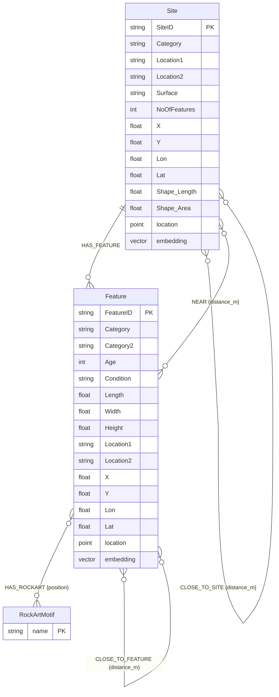

# Graph Schema Diagram -- Neo4j Knowledge Graph

Shows the node labels, their properties, relationships, and index types
in the Neo4j graph database.

## Relationship Semantics

| Relationship | Direction | Condition | Properties |
|-------------|-----------|-----------|------------|
| HAS_FEATURE | Site to Feature | Parent-child | none |
| HAS_ROCKART | Feature to RockArtMotif | Motif present | `position` (int, 1--6) |
| CLOSE_TO_SITE | Site -- Site | distance < 500 m | `distance_m` (float) |
| CLOSE_TO_FEATURE | Feature -- Feature | distance < 500 m | `distance_m` (float) |
| NEAR | Feature -- Site | distance < 500 m, non-parent | `distance_m` (float) |

## Index Types

| Index | Node | Properties | Type |
|-------|------|-----------|------|
| Uniqueness | Site | SiteID | Constraint |
| Uniqueness | Feature | FeatureID | Constraint |
| Uniqueness | RockArtMotif | name | Constraint |
| Property | Feature | Category, Location1, Age | B-tree |
| Property | Site | Category, Location1 | B-tree |
| Point | Site, Feature | location | Spatial (WGS-84) |
| Vector | Site, Feature | embedding | Vector (1536-dim, cosine) |
| Fulltext | Site | Category, Surface | Fulltext |
| Fulltext | Feature | Category, Category2, Condition | Fulltext |

## Cardinalities (from live database)

- Sites: 8,362 nodes
- Features: 16,807 nodes
- RockArtMotifs: 7 nodes
- HAS_FEATURE edges: 16,807
- HAS_ROCKART edges: 16
- CLOSE_TO_SITE edges: 90,101
- CLOSE_TO_FEATURE edges: 426,792
- NEAR edges: 350,091
