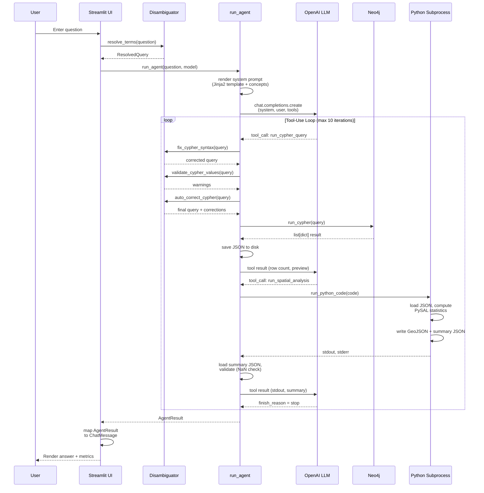

# Sequence Diagram -- Agent Tool-Use Loop

Shows the message flow for a single user question through the LLM agent
loop, including Cypher query execution and spatial analysis.

## Key Observations

- The LLM autonomously decides which tools to call and in what order.
- Cypher queries pass through a 3-stage validation cascade
  (syntax fix, value validation, auto-correction) before execution.
- Spatial analysis runs in an isolated subprocess with a 900-second timeout.
- The loop terminates when the LLM returns `finish_reason = stop` or after
  10 iterations.
- Token usage and cost are accumulated across all iterations.
