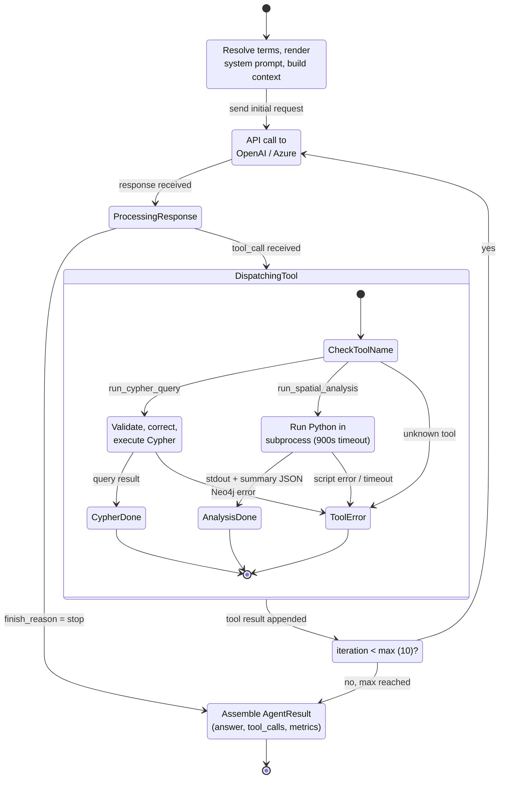

# State Diagram -- LLM Agent Loop States

Shows the state transitions of the LLM agent during a single
`run_agent()` invocation, including tool dispatch and termination
conditions.

## State Descriptions

| State | Module | Key Action |
|-------|--------|------------|
| Initializing | `llm.py` | `resolve_terms()`, `render_template()`, build tool schemas |
| WaitingForLLM | `helper.py` | `chat.completions.create()` with tools parameter |
| ProcessingResponse | `helper.py` | Parse `finish_reason` and `tool_calls` from response |
| ExecutingCypher | `llm.py` | 3-stage validation cascade, `run_cypher()`, save JSON |
| ExecutingAnalysis | `llm.py` | `run_python_code()`, load summary JSON, validate |
| ToolError | `llm.py` | Format error message, record in ToolCallRecord |
| IterationCheck | `helper.py` | Increment counter, compare against `max_iterations` |
| Finished | `helper.py` | Aggregate tokens, cost, duration into AgentResult |

## Termination Conditions

1. **Normal**: LLM returns `finish_reason = stop` with final answer text.
2. **Iteration limit**: 10 tool-use rounds exhausted; last partial answer returned.
3. **API error**: Exception during LLM call; error propagated to caller.
