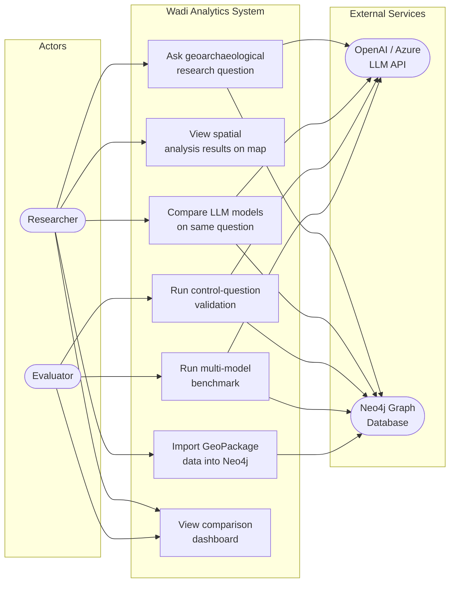

# Use-Case Diagram -- System Actors and Interactions

Shows the primary actors and their interactions with the system.

## Use-Case Descriptions

| ID  | Use Case | Actor | Description |
|-----|----------|-------|-------------|
| UC1 | Ask research question | Researcher | Enter a natural-language question; the LLM agent queries Neo4j and runs PySAL spatial statistics |
| UC2 | View map | Researcher | Explore GeoJSON results on an interactive Pydeck map with H3 hexagon aggregation |
| UC3 | Import data | Researcher | Upload a GeoPackage, trigger the 4-stage ETL pipeline (DuckDB, embeddings, CSV, Neo4j) |
| UC4 | Compare models | Researcher | Run the same question through multiple LLM models and compare metrics side by side |
| UC5 | Validate control questions | Evaluator | Execute 5 predefined research questions and check results against expected outcomes |
| UC6 | Run benchmark | Evaluator | Systematic multi-model, multi-run comparison with Friedman/Nemenyi statistical testing |
| UC7 | View dashboard | Both | Browse saved comparison results with aggregated statistics and bar charts |

## Actor Definitions

- **Researcher**: Domain expert (archaeologist) who uses the system interactively
  via the Streamlit UI to explore spatial patterns in the Wadi Abu Dom data.
- **Evaluator**: Developer or thesis author who validates system correctness and
  compares model performance via CLI scripts.
